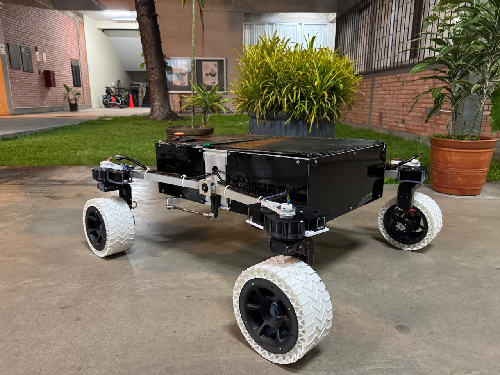

# Autonomous Illariy Rover – European Rover Challenge 2025

This repository contains key modules developed for the **autonomous navigation system** of a custom-built rover for the **European Rover Challenge – On-Site Edition 2025**, as part of the LABMAN team at PUCP.

Presentation Video: https://www.youtube.com/watch?v=TbBJTeVG7Tk

## Project Overview

- Implemented multiple steering modes for a four-wheeled rover with differential suspension, including:
  - Differential steering
  - Ackermann
  - Pure rotation
  - Translation
  - Double Ackermann steering
- Integrated the **Intel RealSense D455 depth camera** for perception and planned future upgrades with **Livox 3D LiDAR** and a **Jetson Orin NX**.
- Developed modules for **visual odometry** and **object classification** using depth data from the D455, leveraging **ROS 2 libraries**.
- Established **wireless communication** between the **Raspberry Pi 5** onboard the rover and the ground station using **Wi-Fi**, supporting the transmission of video and point cloud data via **ROS 2 protocols**.

> ⚠️ *Some components of this project are part of ongoing research and competition development. ROS 2 complete code is not publicly available at this time.*

---

## Tech Stack & Hardware

- ROS 2 (Humble)
- Intel RealSense D455
- Raspberry Pi 5
- Jetson Orin NX (planned)
- Livox LiDAR (planned)
- Wi-Fi Communication Protocols
- Python & C++

---

## Rover Overview

*Rover Overview Image*
